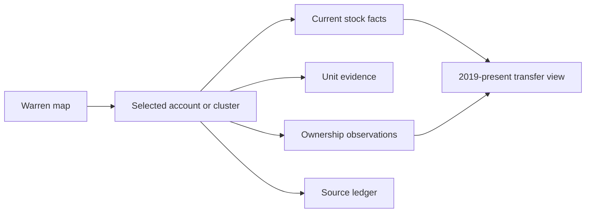
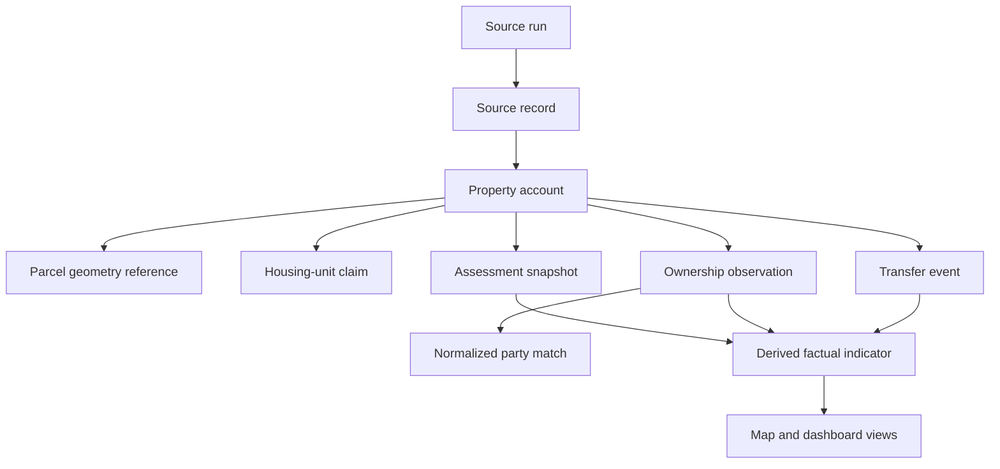

# Warren Baseline Dashboard - Plan

Purpose: Define the accepted Warren-only evidence-first dashboard contract and deferred scope.
Audience: Contributors implementing or reviewing the baseline.
Status: reference
Owner: Open Valley maintainers
Last updated: 2026-08-04

## Goal Capsule

- **Objective:** Create a map-first, researcher-facing dashboard that establishes a facts-only baseline for Warren, Vermont property accounts, housing units, ownership observations, homestead status, and property transfers from 2019 to the present.
- **Product authority:** The dashboard serves the user and local collaborators who need to inspect primary-source evidence, denominators, uncertainty, and refresh dates before making public claims.
- **Active boundary:** Warren is the only geography in this work; the dashboard will be designed so later town comparisons do not change the Warren definitions.
- **Open blockers:** None for the first requirements baseline. Archived annual Grand List snapshots are a dependency for historical ownership and homestead trends, not a reason to invent or backfill them.

## Product Contract

### Summary

The dashboard will use a Warren map as its entry point and let a researcher move from a visible account or cluster to the underlying ownership, unit, assessment, transfer, and source records. It will keep current stock measures separate from historical transfer flow and will show tax accounts and housing units with different denominators.

### Problem Frame

The repository contains a useful current Warren extract, older database models, transfer analysis, and several incompatible historical counts. The current source systems expose different grains: NEMRC records tax accounts, VCGI provides parcel and Grand List fields, and PTTR provides transfer events. Treating those grains as one property table makes it easy to overstate housing-unit counts, deduplicate owners without evidence, or describe a mailing address as proof of residency.

The first product should make the evidence inspectable before it makes the story persuasive. It should support later analysis of second-home ownership and family pressure without asserting either from a single proxy.

### Key Decisions

- **Map-first dashboard** (session-settled: user-directed — chosen over trend-first and evidence-ledger-first layouts: the map should anchor local investigation while the ledger remains visible behind it) governs R8, R10.
- **2019–present transfer window** (session-settled: user-approved — chosen over an immediate ten-year window: the repository documents comparable PTTR coverage beginning in 2019) governs R6, R10.
- **Monthly source checks** (session-settled: user-directed — chosen over quarterly and annual-only checks: the user wants the latest checkable data on a regular basis) governs R7, R11.
- **Two denominators** (session-settled: user-directed — chosen over one simplified homes number: tax accounts and housing units answer different questions) governs R2, R8.
- **Source-exact ownership plus secondary normalization** (session-settled: user-directed — chosen over normalization-only: raw published owner text must remain the fact while normalized parties support analysis) governs R4, R5, R9.
- **Evidence-first ledger model** (session-settled: user-approved — chosen over a flat table and the existing full entity graph: it preserves source facts while limiting premature identity and occupancy inference) governs R1–R7.

### Requirements

#### Data primitives and grains

- R1. The product must distinguish a property account, a physical parcel reference, and a housing unit, with each record carrying its own stable identifier and source provenance.
- R2. A property account must represent one current NEMRC/VCGI tax account, while a SPAN must remain a related identifier that may be shared by multiple condominium accounts.
- R3. A housing-unit record must be attached to a property account and must carry an evidence level of documented, inferred, or unknown; the product must not turn an account count into a unit count by default.
- R4. An assessment snapshot must preserve the source’s dated Grand List year, homestead flag, property category, and assessed values without overwriting prior snapshots.
- R5. An ownership observation must preserve the owner name exactly as published and may reference a normalized person or organization only as a separate, confidence-scored interpretation.
- R6. A transfer event must preserve PTTR seller and buyer fields, stated use, date, price, property identifier, and link confidence; it must remain an event rather than an inferred occupancy transition.
- R7. Every imported source record and derived indicator must be traceable to a source URL or extract, source field, retrieval/check date, and refresh run.

#### Facts and derived indicators

- R8. The product must present `HSDECL` as “homestead filed” and must not rename it to “full-time resident” without a separately supported occupancy observation.
- R9. The product must present mailing geography as “owner mailing address/state” or “out-of-state mailing,” and must not present it as proof of second-home ownership or actual residence.
- R10. The product must separate current stock measures from historical transfer flow, and must not label a transfer as a homestead loss or gain without dated before-and-after assessment evidence.
- R11. Any normalized owner grouping must display its confidence, source observations, and unresolved matches; source-exact names remain the canonical display for account detail.

#### Map-first research workflow

- R12. The map must be the dashboard entry point and must support selecting an account or cluster to open an evidence panel.
- R13. The evidence panel must show current account facts, unit records, source-exact ownership, normalized-party matches, homestead status, mailing geography, assessment values, transfer history, and source dates as separate fields.
- R14. Map symbology and filters must use explicit factual indicators such as homestead filed, non-homestead, mailing geography, unit evidence level, or unknown; labels must not imply a definitive second-home or residency determination.
- R15. The overview must show tax-account counts and housing-unit counts side-by-side, including documented, inferred, unknown, excluded, and unmatched records where applicable.
- R16. The dashboard must provide a current-stock view and a 2019–present-transfer view without combining their denominators or presenting one as a substitute for the other.
- R17. The researcher must be able to open the source ledger for any displayed metric or selected account and see its as-of date and exclusions.

### Dashboard Shape

The map-first layout is a navigation decision, not a change to the data model.

The map, account panel, stock summaries, transfer view, and source ledger must all use the same canonical records and derived indicators.

#### Refresh and quality behavior

- R18. A monthly refresh check must record whether each primary source changed, what was retrieved, and which current snapshot or transfer records were added or unchanged.
- R19. The product must expose source freshness and coverage, including unmatched property accounts, missing homestead flags, unknown unit evidence, missing mailing state, and low-confidence links.
- R20. The product must preserve prior snapshots and source extracts so a changed owner, value, mailing state, or homestead flag can be compared over time.
- R21. If a primary source does not provide an annual historical snapshot, the dashboard must show the historical gap as unavailable rather than interpolate or infer a value.

### Conceptual Data Model

The following relationship is normative for the product vocabulary; implementation may choose different storage mechanisms.

The map and dashboard are projections of these records, not an additional source of truth.

### Actors

- A1. Local researcher or collaborator: inspects accounts, compares denominators, reviews source evidence, and records or approves normalization decisions.
- A2. Primary source systems: VCGI parcel/Grand List data, Warren NEMRC property cards, and Vermont PTTR transfer data provide published observations and events.
- A3. Refresh and review process: retrieves sources, records coverage, preserves snapshots, and flags records that require human review.

### Key Flows

- F1. Monthly source refresh
  - **Trigger:** Scheduled monthly check or a researcher requests a refresh.
  - **Actors:** A2, A3.
  - **Steps:** Retrieve each source; record retrieval and source dates; preserve raw records; append changed snapshots and transfer events; update derived views; expose coverage and freshness.
  - **Outcome:** The dashboard has a dated current view without erasing prior evidence.
  - **Covers:** R4, R6, R7, R18–R21.

- F2. Map-to-evidence investigation
  - **Trigger:** A researcher selects an account or cluster on the map.
  - **Actors:** A1, A3.
  - **Steps:** Show account identity and geometry; show unit evidence; show source-exact ownership; show normalized matches separately; show homestead, mailing, assessment, transfer, and provenance fields.
  - **Outcome:** The researcher can inspect the fact behind every map state.
  - **Covers:** R1–R5, R8–R9, R12–R14, R17.

- F3. Stock-versus-flow comparison
  - **Trigger:** A researcher switches between current stock and transfer history.
  - **Actors:** A1, A3.
  - **Steps:** Keep current account/unit/homestead measures in the stock view; show PTTR events by year in the flow view; show dated assessment transitions only where snapshots exist; preserve unknown and excluded records.
  - **Outcome:** The researcher can describe what changed in the records without treating transaction volume as an occupancy trend.
  - **Covers:** R6, R10, R15–R16, R21.

### Acceptance Examples

- AE1. **Condominium account:** Given two accounts share one SPAN, when the researcher views the map and counts, then the accounts remain distinct while their shared SPAN is visible as a related identifier.
- AE2. **Mailing address caveat:** Given an account has `HSDECL=N` and a Massachusetts mailing state, when it is displayed, then it may be labeled “non-homestead” and “out-of-state mailing,” but not “second home” or “out-of-state resident.”
- AE3. **Unknown unit evidence:** Given an account has no positive unit signal, when totals are shown, then it remains in the account denominator and appears separately as unknown or excluded from the documented/inferred unit denominator.
- AE4. **Transfer without status proof:** Given a PTTR transfer has a secondary-residence buyer declaration but no subsequent assessment snapshot, when the transfer is shown, then it remains a buyer-stated-use event and is not labeled a confirmed homestead loss.
- AE5. **Owner normalization:** Given two source records may refer to the same person or organization, when a normalized party is displayed, then the source-exact owner strings remain visible and the match confidence and review state are shown.
- AE6. **Source freshness:** Given one source has not changed since the prior monthly check, when the dashboard refreshes, then the run records the check and the dashboard shows the source date rather than fabricating a new observation date.

### Success Criteria

- A researcher can select a map object and trace every displayed current metric to a source field and as-of date.
- Tax-account and housing-unit counts are always labeled with their denominators and evidence levels.
- No dashboard label asserts second-home ownership or full-time residency from mailing geography alone.
- Current stock and 2019–present transfer flow can be viewed separately without contradictory totals.
- A source refresh leaves an auditable record of additions, changes, unchanged sources, exclusions, and unresolved links.

### Scope Boundaries

#### Deferred for later

- Archived annual Grand List acquisition and a confirmed year-over-year owner/homestead change series before the first available snapshot.
- Warren affordability, rents, wages, school enrollment, population, and service-access indicators.
- HUUSD town comparison across Fayston, Waitsfield, Duxbury, Moretown, and Waterbury.
- Short-term-rental coverage beyond clearly linked source records.
- Public-facing narrative, policy recommendations, and causal claims about family displacement.

#### Outside this product's identity

- Treating owner mailing address as a definitive residence or second-home classification.
- Replacing published owner names with deduplicated or inferred entities.
- Presenting modeled housing-unit counts as official Grand List counts.

### Dependencies and Assumptions

- VCGI remains the primary parcel/Grand List source for current owner, mailing, homestead, value, and property fields; its layer documents `PARCID`, `SPAN`, `GLYEAR`, `OWNER1/2`, mailing fields, `HSDECL`, and values. See [the VCGI layer](https://services1.arcgis.com/BkFxaEFNwHqX3tAw/arcgis/rest/services/FS_VCGI_OPENDATA_Cadastral_VTPARCELS_poly_standardized_parcels_SP_v1/FeatureServer/0).
- Warren NEMRC remains a current property-card source and may update independently of VCGI. See [the Warren property database](https://nemrc.info/web_data/vtwarr/camadetailT.php?prop=318019).
- PTTR remains the source for transfer events and buyer/seller-stated use; its schema includes seller/buyer state, use descriptions, dates, SPAN, and values. See [the PTTR layer](https://services1.arcgis.com/BkFxaEFNwHqX3tAw/arcgis/rest/services/FS_VCGI_OPENDATA_Cadastral_PTTR_point_WM_v1_view/FeatureServer/0).
- Current Warren source outputs and their fetch/parse/join workflow are documented in [warren/README.md](../../warren/README.md).
- Existing application architecture and research artifacts are context, not canonical data. The current source and model discrepancies are documented in [docs/data-documentation/DATA_STATE_ASSESSMENT.md](../data-documentation/DATA_STATE_ASSESSMENT.md) and [docs/Research_Products/TRANSITION_MAP_METHODOLOGY.md](../Research_Products/TRANSITION_MAP_METHODOLOGY.md).
- Monthly checks do not imply monthly Grand List changes; each source retains its own update cadence and the dashboard must show that cadence.

### Sources and Research

- [Warren standalone data README](../../warren/README.md) — current NEMRC/VCGI extract, row counts, identifiers, and refresh pipeline.
- [Warren joined output](../../warren/outputs/warren_joined.csv) — current combined assessment and GIS extract.
- [Data sources reference](../../DATA_SOURCES.md) — repository’s source field mapping and coverage notes.
- [Dwelling data architecture](../data-documentation/DWELLING_DATA_ARCHITECTURE.md) — existing unit-definition lessons, including CAT/DESCPROP conflicts and invisible ADUs.
- [Calibration properties](../data-documentation/CALIBRATION_PROPERTIES.md) — local examples showing why homestead and mailing indicators must remain separate.
- [De-homesteading report](../Research_Products/DE-HOMESTEADING_WARREN.md) and [transition methodology](../Research_Products/TRANSITION_MAP_METHODOLOGY.md) — prior transfer analyses retained as hypotheses and validation targets, not as canonical results.

### Outstanding Questions

#### Deferred to Implementation

- Measure the generated artifact size and choose the final JSONL partitioning/compression strategy.
- Tune the exact housing-unit evidence thresholds against the first source fixtures without changing the documented/inferred/unknown meanings.
- Select the source archive mechanism for annual Grand List snapshots when the town or VCGI publishes them.

## How This Work Fits Together

<!-- ce-section: work-relationships -->

This plan owns the Warren baseline dashboard and its evidence-first data vocabulary. It establishes the facts and denominators that later research products can reuse.

- **Depends on:** later affordability and family-pressure analysis depends on the account/unit baseline and source ledger established here.
- **Enables:** later HUUSD comparisons can reuse the same account, unit, snapshot, ownership, event, and indicator definitions.
- **Can proceed independently of:** Front Porch Forum analysis and STR enrichment can be developed later without becoming canonical evidence for this baseline.
- **Still to decide:** whether a public narrative should be generated from reviewed dashboard views.

---

## Planning Contract

### Product Contract Preservation

Product Contract unchanged. This section resolves the implementation choices that the brainstorm intentionally left open; it does not add a geography, claim, or audience to the product.

### Key Technical Decisions

- **KTD1 — Bounded evidence-ledger module:** Add a new `src/warren_baseline/` domain and keep the existing person-centric ORM as a compatibility layer. The current `Parcel.span` uniqueness, mutable imports, and residency fields do not represent the account/unit/snapshot grains or the evidence boundary in this contract. A bounded module lets the first dashboard ship without rewriting unrelated community and STR models. Governs R1–R7, R11, R17–R21 and U1–U4.
- **KTD2 — Append-only file-backed ledger for v1:** Materialize dated JSONL records and a manifest under `warren/outputs/baseline/`, with generated read projections for the API. Each run appends or references immutable source observations; current views are derived by `source_run_id` and effective date and promoted through a validated `current_run` pointer. This is the repository's lowest-risk path because `src/database.py` has `create_all` but no migration system, while the committed Warren extract already functions as a reproducible file-based pipeline. A future relational store can consume the same records without changing the product vocabulary. Governs R4, R7, R18–R21 and U1–U3.
- **KTD3 — Account key and geometry join:** Use a jurisdiction/town plus NEMRC `parcel_id`/VCGI `PARCID` as the account identity and retain SPAN as a non-unique related identifier. Join by cleaned PARCID first, SPAN second, preserve `gis_match`, and keep unmatched accounts in the ledger. This follows `warren/scripts/join_nemrc_vcgi.py` and prevents condominium accounts sharing a SPAN from collapsing or inheriting the legacy `Parcel.span` uniqueness constraint. Governs R1–R2, R12, R15, R19 and U1–U3.
- **KTD4 — Local, versioned map projection:** The dashboard reads a generated local map projection tied to a source run; it does not call ArcGIS as the system of record during page load. The existing live `/api/parcels/geojson` path remains available only for compatibility while the baseline routes use the ledger. This makes map state reproducible, exposes source freshness, and prevents a live source update from silently changing a displayed denominator. Governs R7, R12–R19 and U3–U5.
- **KTD5 — Explicit factual indicators only:** Derived fields are limited to `homestead_filed`, `mailing_state`, `out_of_state_mailing`, `unit_evidence_level`, `link_confidence`, and coverage flags. No builder, API serializer, or UI label may derive `full_time_resident`, `second_home`, `de_homesteaded`, or `re_homesteaded` from these fields. The existing `/api/transfers/transitions` classification is retained as a legacy research artifact, not reused by the baseline. Governs R8–R11, R14, R16 and U2–U5.
- **KTD6 — Deterministic fixture and contract verification:** Introduce a small Python test harness around representative source fixtures and API response contracts, plus a focused web component test harness for denominator labels and evidence-panel behavior. Tests must run without a live database or remote ArcGIS service; refresh validation compares source manifests and fixture counts. This is necessary because the repository has no established test, migration, or browser-test convention. Governs R1–R21 and U1–U6.
- **KTD7 — Unit evidence rules:** A `documented` unit claim comes only from an explicit source unit signal (for example, a DESCPROP dwelling count or a source account that represents a condominium unit). An `inferred` claim may use a positive physical signal such as housesite/dwelling value or building evidence when the source does not state a unit count. An active account with no positive signal is `unknown`; inactive/non-residential records may be `excluded` from the unit denominator with a recorded reason. These rules describe evidence availability, not occupancy or use. Governs R3, R14–R16, R19, R21 and U2–U3.
- **KTD8 — Normalization is secondary and reviewable:** Normalize owner strings only for grouping and review queues (stable whitespace/case cleanup plus explicit organization markers); retain every source-exact owner string and never merge parties solely because names look similar. A normalized-party match carries confidence and review state; unresolved matches stay separate. Mailing state is stored as an observation, not as a `Person` residency field. Governs R5, R9, R11, R13 and U2–U3.

### Alternatives Considered

- **Extend `src/models.py` in place:** Rejected for this slice because its `Parcel`/`Dwelling`/`Person` graph is mutable, SPAN-unique, and already encodes unsupported occupancy conclusions. Reuse would make old assumptions indistinguishable from source facts and would require an unplanned migration system.
- **Keep the live ArcGIS map as the source:** Rejected because it cannot reproduce a monthly as-of view, cannot preserve changed owner or homestead observations, and bypasses the source-run ledger.
- **One flattened property table:** Rejected because it cannot keep account and housing-unit denominators separate or represent multiple accounts sharing a SPAN without duplication.

### Assumptions

- The committed `warren/outputs/` extract is the initial reproducible input; a refresh may fetch new NEMRC/VCGI/PTTR data, but raw downloads can remain outside version control when large as long as the manifest records URL, retrieval date, source date, checksum, and parser version.
- The first baseline includes current Warren account/assessment/ownership observations plus PTTR events from 2019 through the latest available record. It does not fabricate annual ownership snapshots where no archived Grand List exists.
- Public-source owner names and mailing fields may be displayed to the intended researcher audience, but the aggregate map feature should expose only the minimum needed for filtering; full source text appears after account selection with provenance.

---

## Implementation Units

### U1. Define the Warren evidence records and source-run manifest

**Goal:** Establish the stable, source-neutral records that every importer, projection, API response, and UI panel consumes.

**Requirements:** R1–R7, R19–R21; A2–A3; F1; AE1, AE5, AE6; KTD1–KTD3, KTD6, KTD8.

**Dependencies:** None.

**Files:**

- `src/warren_baseline/__init__.py`
- `src/warren_baseline/schema.py`
- `src/warren_baseline/lineage.py`
- `tests/warren_baseline/test_schema.py`
- `tests/warren_baseline/fixtures/condo_shared_span.json`
- `tests/warren_baseline/fixtures/account_missing_geometry.json`
- `tests/warren_baseline/fixtures/account_unmatched.json`
- `tests/warren_baseline/fixtures/source_run.json`

**Approach:**

1. Define typed records for `source_run`, `source_record`, `property_account`, `parcel_geometry`, `housing_unit_claim`, `assessment_snapshot`, `ownership_observation`, `normalized_party_match`, and `transfer_event`.
2. Give every record a stable local ID, source key, source URL or extract path, source field references, retrieval/check timestamp, and source effective date where available.
3. Model `property_account` as the jurisdiction/town plus NEMRC/VCGI account grain; attach SPAN and geometry separately, allowing many accounts to reference one SPAN and allowing geometry to be unmatched.
4. Model unit evidence and derived indicators as explicit enums/values, not as `DwellingUse`, `Person.is_warren_resident`, or other legacy occupancy fields.

**Patterns to follow:** Pydantic validation and field descriptions in `src/schemas.py`; source-field preservation in `BronzePTTRTransfer` in `src/models.py`; cleaned PARCID-first / SPAN-second matching in `warren/scripts/join_nemrc_vcgi.py`.

**Test scenarios:**

- A source run with distinct retrieval and source-effective dates validates and serializes without losing either date.
- Two account records with one shared SPAN remain distinct and link to the same parent identifier. Covers AE1.
- A record missing its source URL/extract or stable source key is rejected rather than silently becoming an untraceable dashboard fact.
- A normalized-party match preserves both source-exact owner strings and carries an explicit confidence/review state. Covers AE5.

**Verification:** The schema can represent every product primitive without importing the legacy ORM, and fixture serialization round-trips with stable IDs and complete provenance.

### U2. Build the append-only Warren source adapters and materialized ledger

**Goal:** Convert the current NEMRC/VCGI extract and 2019–present PTTR source records into immutable evidence records with deterministic reconciliation and no unsupported occupancy labels.

**Requirements:** R1–R11, R18–R21; A2–A3; F1, F3; AE1–AE6; KTD2, KTD3, KTD5, KTD7, KTD8.

**Dependencies:** U1.

**Files:**

- `warren/scripts/join_nemrc_vcgi.py`
- `warren/scripts/build_baseline.py`
- `warren/scripts/fetch_pttr_baseline.py`
- `warren/outputs/baseline/manifest.json`
- `warren/outputs/baseline/runs/<source_run_id>/source_run.json`
- `warren/outputs/baseline/runs/<source_run_id>/property_accounts.jsonl`
- `warren/outputs/baseline/runs/<source_run_id>/parcel_geometries.jsonl`
- `warren/outputs/baseline/runs/<source_run_id>/housing_unit_claims.jsonl`
- `warren/outputs/baseline/runs/<source_run_id>/assessment_snapshots.jsonl`
- `warren/outputs/baseline/runs/<source_run_id>/ownership_observations.jsonl`
- `warren/outputs/baseline/runs/<source_run_id>/normalized_party_matches.jsonl`
- `warren/outputs/baseline/runs/<source_run_id>/transfer_events.jsonl`
- `tests/warren_baseline/test_build_baseline.py`
- `tests/warren_baseline/fixtures/warren_joined.csv`
- `tests/warren_baseline/fixtures/warren_pttr.json`

**Approach:**

1. Extend `VCGI_KEEP` in `join_nemrc_vcgi.py` to carry `HSDECL`, `GLYEAR`, `ADDRGL1/2`, `CITYGL`, `STGL`, `ZIPGL`, `OWNER1/2`, `DESCPROP`, and source-date fields needed for assessment, ownership, mailing, and evidence coverage.
2. Have `build_baseline.py` create a run-scoped immutable directory, hash its input extracts, preserve raw source values, and append only new or changed observations. The current account baseline must reconcile 3,105 NEMRC rows, 3,245 VCGI polygons, and 3,003 matched NEMRC centroids while retaining unmatched accounts; compatibility aliases, if needed, are derived outputs rather than mutable source records.
3. Parse `DESCPROP` and related positive signals into documented/inferred/unknown/excluded unit claims without assigning `SECOND_HOME`, `FULL_TIME_RESIDENCE`, or another use category.
4. Preserve owner text exactly as received; derive only normalized grouping keys, mailing state, and the factual `out_of_state_mailing` indicator.
5. Fetch or adapt PTTR records for 2019–present into event records that retain seller/buyer names and states, buyer-stated use text, date, value, coordinates, source payload, and link confidence. Do not compute a homestead transition from seller state or buyer use.
6. Stage immutable records and a manifest only. The map projection is generated by U3 after reconciliation and becomes visible only when the validated run is promoted.

**Patterns to follow:** `warren/README.md` fetch → parse → join pipeline; `scripts/land/import_pttr.py` PTTR field list and OBJECTID deduplication; `scripts/analysis/infer_dwellings_v2.py` positive-signal parsing only; JSON/CSV outputs already used under `warren/outputs/`.

**Test scenarios:**

- A fixture records the current reconciliation (3,105 account rows, 3,245 parcel polygons, 3,003 matched centroids, and 102 unmatched accounts) as a per-run assertion; the pre-change joined fixture demonstrates that `HSDECL` is absent until the join field list is extended.
- A PARCID match wins over a conflicting SPAN match; a SPAN-only fallback is retained with its lower match method; a missing match remains visible with no fabricated geometry. Covers AE1.
- Re-running the same source inputs produces no duplicate source records; changing an owner, value, mailing state, or homestead flag appends a new observation/snapshot while preserving the prior one. Covers AE6.
- `HSDECL=N` plus an `MA` mailing state yields `homestead_filed=false` and `out_of_state_mailing=true`, but no residence or second-home label. Covers AE2.
- An account with no positive unit signal remains in the account denominator and is `unknown`/`excluded` in unit counts; an explicit `& 2 DWLS` signal creates two documented claims without changing the account count. Covers AE3.
- A PTTR record with a secondary-residence buyer declaration is retained as a transfer event and cannot become a confirmed homestead loss without assessment snapshots. Covers AE4.
- A PTTR record with missing coordinates or unmatched SPAN remains in the transfer ledger with `link_confidence` and coverage reason rather than being dropped.
- A second refresh writes a new run-scoped directory and leaves the first run's files byte-for-byte unchanged; the manifest, not directory ordering or file mtime, identifies the promoted run.

**Verification:** The materializer is idempotent, append-only, and produces staged records plus a manifest that reconcile to that run's source row counts and explicitly enumerate missing fields, unmatched joins, and historical gaps. A failed stage leaves the prior promoted run untouched.

### U3. Add denominator-safe stock, evidence, and transfer projections

**Goal:** Provide deterministic read models for current stock, unit evidence, ownership observations, account detail, source coverage, and 2019–present transfer flow.

**Requirements:** R1–R17, R19–R21; A1–A3; F2–F3; AE1–AE6; KTD1–KTD5, KTD7–KTD8.

**Dependencies:** U1, U2.

**Files:**

- `src/warren_baseline/repository.py`
- `src/warren_baseline/projections.py`
- `src/warren_baseline/read_models.py`
- `warren/outputs/baseline/runs/<source_run_id>/map.geojson`
- `tests/warren_baseline/test_projections.py`

**Approach:**

1. Load a selected source run and expose account, geometry, assessment, ownership, unit, and transfer records without mutating them.
2. Build stock summaries with separate `account_denominator` and `unit_denominator` objects, including documented, inferred, unknown, excluded, and unmatched counts.
3. Build account detail by joining only through canonical IDs; include source-exact values, normalized-party matches, factual indicators, transfer events, and source dates as separate fields.
4. Atomically validate a staged run, promote its `current_run` pointer, and then build map features from account geometry and selected filters; build a separate unit-evidence projection when a researcher chooses units, never summing unit claims into account totals.
5. Build transfer flow grouped by event year and stated-use/link-confidence fields; omit status-transition labels and mark the absence of archived assessment snapshots as unavailable.

**Patterns to follow:** Existing `DashboardStatsResponse` and GeoJSON response shapes in `src/main.py`, but replace their old parcel/dwelling semantics with explicit read DTOs; preserve the source-run selection and cache boundary in the repository rather than in UI code.

**Test scenarios:**

- Summary counts report accounts and units under different denominators, with unknown/excluded units visible rather than silently folded into non-homestead.
- A shared-SPAN condominium fixture returns two account features and one SPAN relation; selecting either account returns only its own ownership and assessment observations. Covers AE1.
- A selected account detail includes source-exact ownership, normalized-party status, `homestead_filed`, mailing state, unit evidence, transfer history, and source dates; none is serialized as a residence assertion. Covers AE2, AE5.
- A transfer flow preserves buyer-stated use and event year but reports status transition as unavailable when no before/after assessment snapshots exist. Covers AE4.
- A source run with unchanged inputs reports unchanged coverage and retains the prior as-of date. Covers AE6.
- A failed staged promotion leaves the previous `current_run` pointer and its map/stock outputs readable; a failed PTTR fetch does not erase the last complete parcel snapshot.

**Verification:** Projection outputs are deterministic for a chosen source run, never mix account and unit denominators, expose every metric's source-run/as-of metadata, and are published only after atomic validation/promotion.

### U4. Expose the baseline API and retire unsafe dashboard data paths

**Goal:** Give the web app stable, source-run-aware endpoints for the map-first workflow while preventing stale defaults and legacy proxy labels from becoming the baseline.

**Requirements:** R7–R19; A1–A3; F1–F3; AE1–AE6; KTD4–KTD6.

**Dependencies:** U3.

**Files:**

- `src/warren_baseline/api.py`
- `src/warren_baseline/api_schemas.py`
- `src/main.py`
- `tests/api/test_warren_baseline_api.py`
- `tests/api/fixtures/baseline_snapshot.json`

**Approach:**

1. Add a baseline router with read-only endpoints for summary, account map GeoJSON, account detail, transfer events, and source coverage/freshness. Every response includes source run and as-of metadata.
2. Keep `/api/stats`, `/api/parcels/geojson`, and `/api/dwellings/geojson` available for existing pages during migration, but stop using them from the baseline homepage. Mark `/api/transfers/transitions` as legacy and remove its transition labels from the baseline path.
3. Replace the frontend's hardcoded `getStats()` fallback with an explicit unavailable/error state; never show the old 1,823/2,175 counts when the baseline source cannot be loaded.
5. Enforce map filters and detail responses through the projection service, not ad hoc SQL or live ArcGIS calls; the frontend must render denominator and freshness metadata rather than recompute them.

**Patterns to follow:** FastAPI route organization and Pydantic response models in `src/main.py`; current GeoJSON endpoints for serialization shape; existing one-hour cache only as a response optimization after the source-run selection is stable.

**Test scenarios:**

- The summary endpoint returns distinct account/unit denominator metadata and source freshness fields.
- The map endpoint returns only account features for the account view, preserves unmatched/unknown coverage in metadata, and never labels features as second homes or residents.
- The account detail endpoint returns source-exact owner text and provenance while leaving normalized matches visibly secondary. Covers AE2, AE5.
- The transfer endpoint returns 2019–present events with stated-use/link-confidence fields and no `TRUE_LOSS`/`TRUE_GAIN` status. Covers AE4.
- A missing or invalid snapshot returns an explicit unavailable response; the homepage never falls back to stale hardcoded statistics.
- API responses remain stable when two accounts share a SPAN and when a source row has no geometry. Covers AE1, AE6.
- Route registration through the `src/main.py` adapter exposes the same source-run, effective-date, freshness, coverage, and denominator contract as the standalone API fixture.

**Verification:** API contract tests pass without PostgreSQL, a live ArcGIS service, or a running frontend; response fixtures show source run, denominator, and evidence labels at every relevant boundary.

### U5. Build the map-first evidence-panel dashboard

**Goal:** Make the map the entry point for local investigation while showing facts, denominators, caveats, and source dates clearly enough for researcher review.

**Requirements:** R8–R19; A1; F2–F3; AE1–AE6; KTD4–KTD6.

**Dependencies:** U4.

**Files:**

- `web/src/app/page.tsx`
- `web/src/components/maps/WarrenMap.tsx`
- `web/src/components/maps/WarrenMapLoader.tsx`
- `web/src/components/maps/WarrenEvidencePanel.tsx`
- `web/src/components/maps/WarrenBaselineLegend.tsx`
- `web/src/components/dashboard/StatsGrid.tsx`
- `web/package.json`
- `web/vitest.config.ts`
- `web/src/components/maps/WarrenMap.test.tsx`
- `web/src/components/dashboard/StatsGrid.test.tsx`

**Approach:**

1. Keep the existing MapLibre dynamic-import pattern, but load the local baseline map projection and use account polygons as the default map layer.
2. Add explicit map modes/filters for homestead filed, mailing geography, unit evidence level, and unknown/unmatched coverage; labels must use the factual vocabulary from KTD5.
3. On selection, open an evidence panel with account identity, geometry/source match, current assessment, source-exact ownership, normalized-party review state, homestead filed, mailing state, unit claims, transfer events, and source dates.
4. Place account and unit stock cards side-by-side with denominator labels and an explicit current-stock versus transfer-flow switch. Add a transfer view that shows events and stated uses without calling them status transitions.
5. Remove old “primary residence,” “second home,” and stale hardcoded-stat copy from the baseline page; link to methodology/source coverage where a record is unknown or unavailable.
6. Add a minimal Vitest/React Testing Library setup because the repository currently has no web test harness; keep visual polish and unrelated chat artifacts out of this unit.

**Patterns to follow:** `WarrenMapLoader.tsx` for SSR-safe dynamic imports, MapLibre clustering and controls in `WarrenMap.tsx`, and the existing dashboard card composition in `web/src/components/dashboard/`.

**Test scenarios:**

- Rendering a baseline response shows the map first, account/unit cards side-by-side, and a current-stock/transfer-flow control.
- Selecting an account opens the evidence panel with source-exact owner text and factual labels, including null/unknown states; it does not render “second home,” “resident,” “de-homesteaded,” or “re-homesteaded.” Covers AE2, AE4, AE5.
- The shared-SPAN fixture keeps two account features selectable and does not merge their cards or counts. Covers AE1.
- Unknown and unmatched records appear in the legend/coverage state rather than disappearing from the map or denominator cards. Covers AE3, AE6.
- An API load failure renders an unavailable state and no stale fallback totals.
- Map features remain account-grain even when a selected account has multiple unit claims; the UI does not recompute account or unit percentages from feature counts.

**Verification:** Component tests assert denominator labels and forbidden claim vocabulary; a manual browser pass confirms map selection, panel provenance, filter state, and transfer-view separation against the API fixtures.

### U6. Document refresh operations, source coverage, and compatibility boundaries

**Goal:** Make the baseline refreshable and reviewable by someone other than its author, and prevent older research artifacts from being mistaken for the canonical baseline.

**Requirements:** R7, R10–R11, R17–R21; A2–A3; F1, F3; AE4, AE6; KTD2, KTD5.

**Dependencies:** U2–U5.

**Files:**

- `warren/README.md`
- `DATA_SOURCES.md`
- `docs/data-documentation/WARREN_BASELINE_DATA_MODEL.md`
- `docs/data-documentation/DATA_STATE_ASSESSMENT.md`
- `docs/Research_Products/TRANSITION_MAP_METHODOLOGY.md`
- `tests/warren_baseline/test_refresh_manifest.py`

**Approach:**

1. Document the canonical record grains, field-to-source mapping, source-run manifest, unit evidence rules, denominators, and monthly refresh review steps.
2. Record the current source coverage and historical gap without copying stale 1,823/3,109/2,175 totals into the baseline documentation.
3. Mark the old person-centric import and transition map as non-authoritative compatibility/research artifacts; link readers to the new baseline vocabulary and explain why proxy transitions are not status changes.
4. Document how a refresh reports changed, unchanged, missing, unmatched, and low-confidence records and how a failed run leaves the prior materialized view intact.

**Patterns to follow:** Existing source tables in `warren/README.md`, field references in `DATA_SOURCES.md`, dwelling evidence caveats in `docs/data-documentation/DWELLING_DATA_ARCHITECTURE.md`, and calibration examples in `docs/data-documentation/CALIBRATION_PROPERTIES.md`.

**Test scenarios:**

- A refresh manifest records source URL, retrieval/check date, source date, row counts, checksums, parser version, and unchanged/changed status for each source.
- A staged → validated → promoted refresh sequence updates the `current_run` pointer only after all required source and reconciliation checks pass; a failed or incomplete refresh does not replace the last complete materialized map/source-run pointer.
- Documentation examples use the current account denominator and explicitly label unit evidence and historical availability; no legacy proxy is presented as a confirmed trend.

**Verification:** A new collaborator can identify the canonical artifacts, reproduce a fixture refresh, explain each denominator, and locate the source evidence for a displayed metric without relying on stale research notes.

---

## Verification Contract

### Required gates

- **Schema gate:** All canonical records validate, carry stable IDs, and include source provenance; shared-SPAN and missing-geometry fixtures remain representable.
- **Reconciliation gate:** Each source run records its NEMRC/VCGI row counts, match counts, unmatched accounts, and coverage reasons; the initial fixture asserts 3,105 NEMRC rows, 3,245 VCGI polygons, 3,003 matched centroids, and 102 unmatched accounts. Any discrepancy is reported in the manifest, not hidden by filtering.
- **Lineage gate:** Every map feature, stock metric, unit claim, ownership observation, and transfer event resolves to a source run, source URL/extract, source field(s), and as-of date.
- **Idempotence gate:** Re-running identical inputs produces no duplicate records; changed source observations append new snapshots and leave prior snapshots queryable.
- **Immutability gate:** A later run writes a new run-scoped artifact set and does not mutate prior run files; the promoted run is selected by the manifest/current pointer rather than directory order or file mtime.
- **Denominator gate:** Account percentages divide by account totals; unit percentages divide by the declared documented/inferred/known unit denominator; excluded and unknown records are visible in metadata.
- **Interpretation gate:** No API or UI response contains unsupported occupancy/status labels; mailing and homestead indicators use the exact factual vocabulary.
- **API gate:** API contract fixtures pass without PostgreSQL or network access and include source-run, as-of, coverage, and denominator metadata.
- **UI gate:** Component tests plus a manual browser pass cover map-first selection, evidence panel provenance, unknown/unmatched filters, stock/flow separation, and unavailable-source behavior.
- **Refresh gate:** A simulated monthly run exercises staged → validated → promoted states, records unchanged sources, and leaves the prior complete projection active when a source fetch fails.

### Verification order

1. Validate schema and fixtures before changing import or API code.
2. Reconcile the materialized ledger and refresh behavior.
3. Verify projections and API contracts against the same snapshot fixtures.
4. Verify the map and dashboard using API fixtures, then perform the browser pass against a local baseline artifact.
5. Review the documentation and compatibility warnings against the final response vocabulary.

---

## System-Wide Impact

- **Data pipeline:** `warren/scripts/` gains source-run metadata and richer VCGI/PTTR field preservation; existing outputs remain usable inputs.
- **Backend:** `src/warren_baseline/` becomes the canonical read path for the new dashboard. Existing SQLAlchemy entities and legacy endpoints are not deleted in this slice, but the baseline must not depend on their inferred fields.
- **Frontend:** The root dashboard changes from live VCGI/old-table data plus stale fallback values to source-run-aware local projections, with a new account evidence panel and factual legends.
- **Compatibility:** Existing chat artifacts, STR review pages, and the `/story` transition visualization may continue to use legacy APIs while they are explicitly marked non-authoritative. A later migration can move them onto the ledger after the baseline stabilizes.
- **Privacy and exposure:** Owner names and mailing fields are public-source observations but still personal data. Aggregate features should avoid emitting full mailing strings; selected-account detail should show only the source fields needed for evidence review and link back to the public source.
- **Operational state:** No database migration is required for the first slice. The source-run manifest and complete-materialized-view pointer are the rollback boundary; future relational persistence must consume the same record contract rather than replacing it silently.

---

## Risks and Dependencies

| Risk or dependency | Mitigation / verification |
|---|---|
| VCGI and NEMRC update on different schedules | Preserve source-specific effective/retrieval dates and show them independently in the source panel. |
| SPAN is shared by condominium accounts | Use PARCID/NEMRC account identity first; fixture-test two accounts sharing one SPAN. |
| `HSDECL` is currently omitted from the joined CSV | Extend the join field list and assert non-empty `HSDECL` in the post-change fixture. |
| Existing imports clear/overwrite derived tables | Keep the baseline append-only and do not route it through `import_vermont_unified.py` until a migration-safe adapter exists. |
| PTTR buyer/seller proxies are mistaken for status changes | Store event fields and link confidence only; require dated assessment snapshots for any future transition analysis. |
| No historical Grand List archive exists | Show the gap as unavailable and preserve current snapshots for the first future comparison. |
| Owner identity normalization creates false merges | Keep source-exact names canonical, expose confidence/review state, and leave unresolved matches separate. |
| Source extracts or map GeoJSON become too large | Keep raw fetches outside version control with checksums; serve a run-specific materialized map projection and measure payload size during implementation. |
| No established Python/web test or migration harness | Add fixture/API tests and a minimal web test setup as scoped units; defer broad test-framework cleanup. |

---

## Open Questions

### Resolved during planning

- **Storage for first release:** append-only, source-run-keyed JSONL plus generated projections; relational migration is deferred until the record contract is exercised.
- **Unit evidence classification:** documented/inferred/unknown/excluded rules are owned by KTD7 and are not occupancy claims.
- **Map source:** local materialized projection selected over live ArcGIS request-time data.
- **Legacy paths:** remain for compatibility but are not used by the baseline homepage and are documented as non-authoritative.

### Deferred to implementation

- Exact JSONL partitioning and compression strategy after measuring the current source/output size.
- Final filter parameter names and pagination limits after API fixture payloads are sized.
- Whether to add a relational persistence adapter after the append-only ledger has a stable refresh history.
- The exact source archive mechanism for annual Grand List snapshots when the town or VCGI publishes them.

---

## Definition of Done

- The Warren baseline schema and source-run manifest represent account, parcel/geometry, unit claim, assessment snapshot, ownership observation, normalized-party match, transfer event, and derived factual indicators with source provenance.
- The initial materialized ledger reconciles the current Warren source counts, preserves unmatched accounts and shared-SPAN accounts, and is idempotent across refreshes.
- Current stock summaries and 2019–present transfer flow expose separate denominators and never present mailing state, `HSDECL`, seller state, or buyer-stated use as definitive occupancy/status.
- Baseline API endpoints serve a local source-run projection with account detail, evidence, coverage/freshness, and transfer event contracts; stale hardcoded homepage fallbacks are removed.
- The map-first homepage opens an evidence panel on account selection, uses factual legends/filters, shows account and unit counts side-by-side, and separates stock from flow.
- Fixture, API, and web component tests plus the documented browser pass cover the acceptance examples and verification gates in this plan.
- Refresh and data-model documentation identifies canonical artifacts, source fields, monthly checks, historical gaps, and the non-authoritative status of older proxy analyses.
- No HUUSD comparison, affordability/family-pressure metric, causal narrative, or definitive second-home percentage is introduced before the Warren baseline is independently reviewable.
