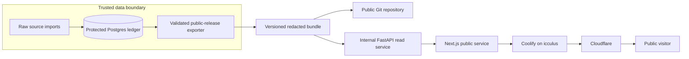

# feat: Publish a redacted Mad River Valley baseline

## Goal Capsule

- **Objective:** Publish Open Valley at `openvalley.maconphillips.com` as a transparent, work-in-progress Mad River Valley civic-data project, with Warren as the only released geography.
- **Public contract:** The public repository, deployed images, web UI, and public API contain only a redacted release bundle. Raw owner, mailing, review, and source-record data live in protected Postgres and are never served to a browser.
- **Authority:** The public app reports source observations and coverage. It does not determine a person's residence, occupancy, property use, or second-home status.
- **Stop conditions:** Do not launch until the raw-data migration is validated, the repository and its reachable history are scrubbed, the public-release scan passes, and the deployed hostname passes the operational checks.

---

## Product Contract

### Summary

Open Valley will be a public window into reproducible, redacted property-data releases for the Mad River Valley.
The first release is a Warren baseline, not a regional comparison or a statewide claim.
Visitors can inspect the map, counts, source run, coverage, and data limits without receiving owner or mailing data.

### Problem Frame

The current repository is public and contains raw owner and mailing fields in both current files and reachable Git history.
The current FastAPI detail route also returns those records, and the source tree contains obsolete product claims, former database architecture, and unused MDX content that conflict with the active evidence-first baseline.
Publishing the current application would therefore make its privacy boundary and project purpose unclear.

### Requirements

#### Public release and data boundary

- R1. Public Git history, deployment images, static assets, API responses, logs, temporary files, and documentation must exclude raw owner names, mailing addresses, mailing states, review notes, raw source-record payloads, protected paths, connection strings, and exception representations that disclose them.
- R2. A protected Postgres service separate from the public Compose application must retain the raw, append-only source ledger and human-review records. It must have no public port or domain, separate import/export/operator identities, encrypted backups, secret rotation, and no credential configured in a public container.
- R3. A release exporter must produce a versioned, schema-validated public bundle from a validated private source run. Artifact schemas must be strict allowlists, reject unknown nested fields, and fail closed when their output contains restricted fields or values.
- R4. Every public release must expose non-personal provenance: town, run, retrieval timestamp and timezone, release version, aggregate input checksums, coverage numerator/denominator, and a schema-validated provider-level source descriptor. A source descriptor may contain safe provider URLs, retrieval metadata, aggregate checksums, and field labels only; it must not contain row snippets, property URLs or identifiers, raw filenames, or payloads.
- R5. The public API must serve only the redacted bundle. Account-detail and review routes must not be reachable in the deployed public service.

#### Public experience and project language

- R6. The site must identify Open Valley as a work in progress for the Mad River Valley and identify Warren as the currently released area.
- R7. The site must explain, near the map, that `HSDECL` is shown as a homestead-filing observation and that neither homestead nor non-homestead establishes occupancy, residency, rental activity, commercial use, or second-home use.
- R8. The site must show source freshness, coverage, and unknowns without presenting a housing or ownership conclusion beyond the available records.
- R9. The public repository must retain a concise README, methodology, and operations guide that explain the public/private boundary and how to reproduce a public release without publishing raw data.
- R10. Obsolete narrative, policy, agent, database, STR, and transition-analysis material must be removed from the public tree rather than presented as current project documentation.

#### Deployment and operations

- R11. Coolify on `icculus` must run the public Next.js service and its internal FastAPI read service as one deployment; only the web service receives the public hostname.
- R12. Cloudflare must proxy `openvalley.maconphillips.com` to the Coolify origin with valid origin TLS and Full (strict) encryption.
- R13. A failed build, unsafe release bundle, unhealthy service, or unavailable internal API must fail safely without exposing the protected ledger or a partially generated release.
- R14. The repository rewrite and deployment cutover must include rollback points, collaborator coordination, and post-change verification.
- R15. Public map information must have a keyboard-accessible equivalent that does not require pointer hover or click.
- R16. The Warren release must meet a published bar: 100% public-artifact schema/provenance validation, at least 96% matched geometry and known homestead-field coverage, no more than 90 days since retrieval unless the site displays an unavailable/stale notice, and 100% restricted-data scan success.

### Acceptance Examples

- AE1. Given a public visitor requests the map, when the response is inspected, then it contains the map-safe fields and no owner, mailing, review, or raw-record field.
- AE2. Given a public visitor requests an account-detail or review route, when the request reaches the deployed public API, then it receives no private record.
- AE3. Given the private ledger contains a Warren source run, when a release is exported, then its manifest identifies its run, coverage, retrieval date, and release version while its separate provider descriptors identify source links and field labels without serializing a protected value.
- AE4. Given a visitor reads the dashboard, when they encounter the homestead metrics or map legend, then they can see that the labels describe source tax fields rather than occupancy or second-home status.
- AE5. Given a later town is added, when it is released, then it can use the same private-ledger and public-bundle conventions without changing Warren's definitions.

### Scope Boundaries

#### Included

- Warren's current redacted release, with the project positioned for the Mad River Valley.
- Private Postgres migration for currently committed raw property/source/review data.
- Public repository sanitation, documentation replacement, deployment configuration, and Cloudflare/Coolify launch.

#### Deferred for later

- A public account-research interface, authenticated reviewer interface, user submissions, and public editing workflow.
- New source acquisition, regional comparison statistics, additional town releases, automated refresh scheduling, and a policy or advocacy narrative.
- Origin-wide firewall changes or Cloudflare Authenticated Origin Pulls, which affect other services on `icculus` and need a separate server-wide review.
- Actual ingestion or public release for another Mad River Valley or Vermont town. This plan adds only town-keyed boundaries required to keep a future addition from changing Warren semantics.

#### Outside this product's identity

- A public claim that a property is a second home, primary residence, rental, commercial property, or occupied based on the current source fields.
- Releasing raw owner, mailing, review, or source-record data merely because it came from a public source.

---

## Planning Contract

### Key Technical Decisions

- KTD1. **Use protected Postgres as the raw ledger and a committed redacted bundle as the public data product.** (session-settled: user-directed — chosen over making the repository private: the methodology and release artifacts must remain publicly inspectable.) The deployed services have no database credentials, so a web/API error cannot fall through to raw records. Governs R1–R5, R13.
- KTD2. **Use town-keyed design without building multi-town ingestion.** (session-settled: user-directed — chosen over a Warren-branded one-off: future Vermont releases must not change Warren semantics.) Open Valley is framed around the Mad River Valley, but Warren is the only bundle or ingestion target in this work. Governs R2–R4, R6, R8, R9, R16.
- KTD3. **Replace rather than archive legacy public prose.** The remaining public documentation will describe the active product only; removed research, analysis, and agent-era material remains neither deployed nor discoverable from the cleaned repository. Governs R9–R10.
- KTD4. **Use a two-service Coolify Compose deployment with same-origin proxying.** The public Next.js service proxies only to an internal FastAPI service that reads the release bundle. The FastAPI service has no public domain or host port. Governs R5, R11–R13.
- KTD5. **Perform sensitive-data remediation as a coordinated, destructive release gate.** A private backup and database validation precede history rewriting. The cleaned mirror replaces all reachable refs only after the release-boundary scan passes. Governs R1, R14.

### High-Level Technical Design

The exporter is the only bridge from the trusted ledger to the public release.
It writes an allowlisted manifest, summary, trend observations, source descriptors, and map projection.
The API reads those files only; it has no route or dependency for raw-account detail.

### Public Release Contract

Each release directory uses a stable town and source-run identity, with a small current pointer.
The allowlisted payloads are the only data copied into Git and container images:

| Artifact | Purpose | Explicitly excluded |
|---|---|---|
| Release manifest | town, run, retrieval time/timezone, release version, aggregate checksums, coverage | provider links, raw source payloads, and review metadata |
| Map projection | address, geometry, GIS link, tax-status bucket, unit-evidence summary | account-detail, owner, mailing, and review fields |
| Summary and trend | denominators, `HSDECL` observations, coverage, caveats | occupancy/use conclusions and source rows |
| Provider descriptors | safe provider URLs, retrieval metadata, aggregate checksums, and field labels | row snippets, property URLs/identifiers, raw filenames/payloads, and private storage locations |

### Flow and Edge-Case Findings

- **Private-to-public export:** An export with an invalid run, missing required provenance, unknown schema field, or any restricted value stops before it updates the current pointer. Logs identify only the artifact and field. The previous public bundle remains deployable.
- **Public request:** A missing bundle returns a controlled unavailable response. A request for a former account-detail or review route returns not found, never a fallback ledger response.
- **Deployment:** The web process starts only after the internal API health check validates the current pointer and required public artifacts. The API starts without Postgres because it reads the committed public bundle.
- **History rewrite:** A clone, fork, open PR, tag, release asset, Actions artifact/cache, package, Pages site, mirror, or old image can retain or reintroduce removed files. Treat cleanup as exposure mitigation with a freeze, fresh clone requirement, inventory, and follow-up GitHub support request; it is not retraction.
- **Accessible map use:** The parcel list has a deterministic address/account order, a keyboard activation control, selected-state synchronization with the map, visible focus treatment, and an accessible label. Loading, unavailable, incomplete-coverage, malformed-map-field, and API-failure states remain understandable without pointer interaction.

### Assumptions

- The existing Coolify server on `icculus` can host a new Compose application and a protected Postgres service on a network separate from the public application.
- An authorized operator can obtain the existing origin address used by `maconphillips.com`, manage the Cloudflare zone, and temporarily permit a force push to `main`.
- The raw data needed for the first migration will be copied to a protected location before it is removed from the repository. No raw file is recreated in the cleaned public worktree.

### Risks and Mitigation

| Risk | Mitigation |
|---|---|
| History rewrite does not retract existing clones, forks, or cached GitHub objects | Audit forks and refs, coordinate fresh clones, submit the required GitHub Support removal request, and record the residual exposure honestly. |
| Raw migration is incomplete before files are removed | Require source-run count/checksum validation in protected Postgres before rewrite; retain a private backup until validation succeeds. |
| A future code change leaks a field into the release | Use an allowlist exporter plus fixture tests and a release-tree restricted-field scanner in CI. |
| Coolify exposes the API service | Give the domain only to the web service; use the managed Compose network and no API host port. |
| Cloudflare origin TLS is misconfigured | Obtain Coolify's valid certificate before enabling proxied traffic and verify Full (strict) from edge to origin. |
| Initial deployment fails | Do not route the hostname until the redacted services pass health checks, or serve a prebuilt redacted maintenance image. Never point back to a legacy/raw-data image. |

---

## System-Wide Impact

- **Data lifecycle:** Raw input moves from tracked files to protected Postgres. The exporter, not a web request or a container build, is the sole transition into a public artifact. It uses a private temporary directory, cleans it after validation, and retains the migration backup only until count/checksum validation succeeds.
- **Public interfaces:** `/api/baseline/accounts/{account_id}` and any review surface cease to be public contracts. Consumers retain the map, summary, trend, source-descriptor, and health interfaces only.
- **Repository consumers:** Existing clones, open branches, and documentation links will diverge after rewriting history. Contributors must reclone or rebase from the cleaned `main`; stale URLs and legacy documentation are intentionally not preserved.
- **Operations:** Coolify holds deployment-only configuration for the web/API pair. Protected database access belongs to the import/export operator in a separate private service/network and never to browser-facing services or GitHub Actions. The database is not merely a schema reachable from the public deployment.
- **Future towns:** A new town requires a separately approved scope, validated private run, and its own redacted release directory. This plan does not ingest or release another town.

---

## Implementation Units

### U1. Establish the protected raw-ledger and migration path

- **Goal:** Move raw current data and future source runs into protected Postgres without changing their append-only provenance semantics.
- **Requirements:** R1, R2, R14.
- **Dependencies:** None.
- **Files:** `pyproject.toml`, `uv.lock`, `src/warren_baseline/private_ledger.py`, `warren/scripts/build_baseline.py`, `warren/scripts/migrate_private_ledger.py`, `warren/scripts/import_private_run.py`, `tests/warren_baseline/test_private_ledger.py`, `.env.example`.
- **Approach:** Add a narrowly scoped Postgres adapter and migrations for source runs, raw source records, ownership observations, review records, and the remaining baseline primitives. Move the existing materialization flow onto an untracked raw-workspace-to-private-ledger path. Use a protected database service that is separate from the public Compose network, with distinct import-writer, export-reader, and backup/operator identities, encrypted backups, and rotation procedure. Use private temporary directories with cleanup; make import commands accept a protected input location and `DATABASE_URL`; keep both out of version control, public containers, and logs. Retain the private migration backup only through count/checksum validation, then securely dispose of it according to the operator's protected-storage policy.
- **Execution note:** Start with migration/import characterization fixtures from the current Warren run, then validate row counts and checksums against the private backup before any cleanup.
- **Patterns to follow:** `src/warren_baseline/schema.py` for strict evidence records and `warren/scripts/build_baseline.py` for source-run construction.
- **Test scenarios:**
  - Import a synthetic fixture source run and retain its source-run, town, record type, and checksum relationships.
  - Reject a malformed raw record without partially marking its run as validated.
  - Keep review records bound to their original source run.
  - Read a Warren run and a second town identifier without cross-town record leakage.
  - Verify that a public-container configuration cannot authenticate or route to the protected database.
- **Verification:** A protected database can round-trip a validated fixture run and reports the expected counts/checksums.

### U2. Generate and enforce the redacted public-release bundle

- **Goal:** Make a versioned, reproducible public projection that is safe to commit and deploy.
- **Requirements:** R1, R3, R4, R5, R8, R16; AE1, AE3, AE5.
- **Dependencies:** U1.
- **Files:** `src/warren_baseline/public_release.py`, `src/warren_baseline/public_schema.py`, `warren/scripts/export_public_release.py`, `releases/README.md`, `releases/warren/`, `tests/warren_baseline/test_public_release.py`, `tests/warren_baseline/fixtures/`.
- **Approach:** Define strict versioned schemas for every artifact and provider descriptor. Export only the Public Release Contract artifacts, each with a schema/release version, town, run identifier, and atomic current pointer. Reject unknown top-level or nested fields. Derive map/status values through the existing source-safe tax-status logic. Add a reusable restricted-field/value scan that applies to every generated JSON, JSONL, and GeoJSON release artifact before it is promoted and emits only safe field/path diagnostics.
- **Execution note:** Prove the exporter with the current Warren fixture before exporting the private production run.
- **Patterns to follow:** `BaselineRepository.promote`, `MAP_PROJECTION_FILENAME`, and the existing source-run/coverage structures in `src/warren_baseline/repository.py`.
- **Test scenarios:**
  - A validated fixture run produces a complete public manifest, summary, trend, source descriptors, and map projection.
  - A provider descriptor accepts only safe URLs, retrieval metadata, aggregate checksums, and field labels; row snippets, per-property locators, raw filenames, and unknown nested fields fail validation.
  - The map retains address, geometry, tax-status bucket, and unit evidence but excludes every restricted owner/mailing/review field.
  - A payload containing a restricted field or known protected value prevents promotion, leaves the prior current pointer unchanged, and reports only the artifact path and field name.
  - A missing or unvalidated raw run cannot generate a public release.
- **Verification:** The committed `releases/warren/` bundle is independently readable and passes the restricted-data scan.

### U3. Restrict the deployed API to public release artifacts

- **Goal:** Serve a bounded public API with no runtime path to the protected ledger.
- **Requirements:** R1, R4, R5, R13; AE1, AE2, AE3.
- **Dependencies:** U2.
- **Files:** `src/warren_baseline/repository.py`, `src/warren_baseline/api.py`, `src/warren_baseline/app.py`, `tests/warren_baseline/test_api.py`, `tests/warren_baseline/test_repository.py`.
- **Approach:** Replace raw-ledger reads with a release-bundle reader and expose only summary, map, public trend, public provider descriptors, and a `/healthz` endpoint. Health validates the current pointer and each required public artifact without database access. Remove the account-detail route, direct-browser API configuration, and permissive cross-origin configuration because deployed browser requests use only the Next.js same-origin proxy.
- **Execution note:** Add API contract tests before removing the raw route so a later compatibility change cannot restore it accidentally.
- **Patterns to follow:** `FileResponse` for immutable map delivery and the existing controlled 404/503 response wrapper.
- **Test scenarios:**
  - Each public endpoint returns only the allowlisted public artifact shape.
  - Account-detail and review paths return not found.
  - A missing current release returns a controlled unavailable response without a stack trace or raw path.
  - The health endpoint succeeds without a database connection.
  - A health check fails safely when the current pointer or a required artifact is missing.
- **Verification:** API fixtures demonstrate that the public service has no raw-account dependency or direct database configuration.

### U4. Rebuild the public site and concise project documentation

- **Goal:** Make the public experience clear, modest in its claims, and aligned with the new release boundary.
- **Requirements:** R6, R7, R8, R9, R10, R15; AE4.
- **Dependencies:** U2, U3.
- **Files:** `web/src/app/page.tsx`, `web/src/app/layout.tsx`, `web/src/components/baseline/BaselineDashboard.tsx`, `web/src/components/baseline/BaselineMap.tsx`, `web/src/components/baseline/mapProperties.ts`, `web/src/components/baseline/mapProperties.test.ts`, `README.md`, `AGENTS.md`, `docs/methodology.md`, `docs/operations.md`, `warren/README.md`, `web/README.md`, `web/src/content/posts/`, obsolete files under `docs/`, `DATA_SOURCES.md`, `WARREN_HOUSING_RESEARCH.md`, `STARTUP.md`, `stop-dev.sh`, `CLAUDE.md`, `.source/`, `.github/workflows/docs-protection.yml`.
- **Approach:** Replace the root README with a short public project guide: Mad River Valley scope, Warren-first status, public/private boundary, release artifacts, local preview, and verification. Add a compact methodology page and an operations guide with no credentials or personal data. Add a short `AGENTS.md` that codifies the public-release safety rules for every contributor: raw data and logs stay private; public services read release artifacts only; browser requests are same-origin; schemas fail closed; operators alone handle private data; claims must remain evidence-bound; public preflight precedes history rewrite; and a failed launch never restores a legacy/raw image. Delete obsolete Markdown, unused MDX, stale generated-doc tooling, legacy-document checks, and commands that describe removed services. In the dashboard, add a visible work-in-progress/data-limits section and a provenance block that labels town, run, retrieval timestamp/timezone, release version, coverage numerator/denominator, and provider links; use the public descriptor instead of hardcoded claims. Pair the pointer-driven map panel with a keyboard-operable parcel summary/list that has deterministic ordering, an activation control, synchronized selection, visible focus, and screen-reader labels.
- **Patterns to follow:** The current map-safe display shape in `web/src/components/baseline/mapProperties.ts` and evidence-first language in `README.md`.
- **Test scenarios:**
  - The dashboard renders a returned source run and coverage note without exposing a private field.
  - Map selection still handles missing or malformed optional public fields.
  - A keyboard user can reach and read the same public parcel summary without using map hover or click.
  - Map and list selection remain synchronized and expose the same selected state to assistive technology.
  - Loading, unavailable, incomplete-coverage, malformed-map-field, and API-failure states show a source-safe explanation.
  - The provenance block displays town, run, retrieval timestamp/timezone, release version, coverage numerator/denominator, and provider links from the public descriptor.
  - Public UI and retained docs contain no unsupported second-home/residency classification language.
  - Removed MDX and legacy-document imports are absent from the Next.js build.
- **Verification:** The rendered home page tells a visitor what is released, what the fields mean, what remains unknown, and that the work is in progress.

### U5. Containerize the redacted public release for Coolify

- **Goal:** Deploy the web and internal read API reliably on `icculus` without bundling or exposing raw data.
- **Requirements:** R1, R5, R11, R13.
- **Dependencies:** U3, U4.
- **Files:** `Dockerfile.api`, `Dockerfile.web`, `docker-compose.coolify.yml`, `.dockerignore`, `web/next.config.ts`, `src/warren_baseline/app.py`, `.env.example`.
- **Approach:** Build separate minimal images for the FastAPI release reader and the Next.js app. Browser requests stay relative to `/api/baseline/*`; only the Next.js server receives `INTERNAL_BASELINE_API_URL`. Remove `NEXT_PUBLIC_BASELINE_API_URL` and fail builds/configuration that restore a direct browser API setting. Keep the API on the Coolify-managed network with no public domain or host-port mapping. Include only application code and `releases/` in the images, add explicit health checks, require the web service to use Compose `depends_on` with `service_healthy` for the API, and use no custom Compose networks.
- **Execution note:** This is packaging work; prioritize image inspection and service smoke checks over unit-only confidence.
- **Patterns to follow:** The existing Next rewrite in `web/next.config.ts`; Coolify's managed Compose network and domain routing.
- **Test scenarios:**
  - The Compose configuration exposes the web service but not an API host port.
  - The web service proxies a map request to the internal API using the service name.
  - Both images build with no ignored raw output copied into a layer.
  - The build/configuration fails when a public browser API-base variable is present.
  - The web service waits for the API health check and the health endpoint validates public artifacts without Postgres.
  - An unavailable API produces the dashboard's existing bounded error state.
- **Verification:** A local Compose smoke run serves the web page and public API routes while the API is unreachable from the host network.

### U6. Add public-repository release guardrails

- **Goal:** Prevent sensitive data and retired content from returning after the cleanup.
- **Requirements:** R1, R3, R9, R10, R14.
- **Dependencies:** U2, U4, U5.
- **Files:** `.gitignore`, `.github/workflows/public-release.yml`, `scripts/check_public_tree.py`, `tests/warren_baseline/test_public_release.py`, `README.md`, `AGENTS.md`.
- **Approach:** Ignore all raw fetch/output/review paths and allowlist `releases/` as the sole committed data product. Replace real property fixtures with synthetic values before history cleanup. Replace the stale documentation workflow with checks that validate strict release schemas, scan release artifacts and tracked paths for restricted fields, verify the clean documentation inventory, run baseline/backend tests, frontend tests, lint, build, and Compose validation. Run private-ledger integration tests against an ephemeral CI Postgres service only. Ensure scanners and CI logs report only artifact paths and field names. Keep deployment credentials and the protected production `DATABASE_URL` out of GitHub Actions.
- **Patterns to follow:** Focused baseline test commands and the current frontend package scripts, after their active guidance is moved into the new README/operations guide.
- **Test scenarios:**
  - A fixture release with a mailing or owner field fails the guard.
  - A tracked raw-output path or non-synthetic fixture fails the guard.
  - A redacted valid release passes the guard and the normal frontend/backend suites.
  - The deployment configuration remains valid after environment placeholders are substituted.
  - CI uses an ephemeral database and fails if it reads a production database variable.
- **Verification:** A pull request cannot merge a raw record, a forbidden release field, or a stale public documentation surface.

### U7. Sanitize history and launch the public release

- **Goal:** Replace the public repository history safely, then route the public hostname to the validated Coolify release.
- **Requirements:** R1, R11–R14.
- **Dependencies:** U1–U6.
- **Files:** `docs/operations.md`, `README.md`.
- **Approach:** First commit the reviewed plan and complete U1–U6. If any current public deployment serves a raw route, disable or contain that route immediately. Then document and execute this operator-owned sequence: freeze changes and close/rebase open work; make a private backup; import and validate the raw ledger; inventory refs, forks, tags, releases/assets, LFS, Actions logs/artifacts/caches, Packages, Pages, mirrors, and old deployment images; review a fresh mirror of the cleaned public tree; use `git-filter-repo` to remove raw output paths, private-data files, obsolete narrative/docs, and deleted legacy material from all relevant history; audit refs/forks; force-push only after approval; request GitHub cache/PR cleanup; require collaborators to reclone. The removal inventory explicitly includes `warren/outputs/`, `data/` content, current/legacy source ledgers, review files, stale documentation, and unused MDX. In Coolify, create the Compose application from `main`, bind `https://openvalley.maconphillips.com` to the web service, and keep the database/private export process separate. In Cloudflare, create the web DNS record to the existing `icculus` origin, verify origin TLS, enable proxying, and set Full (strict). For first-launch failure, leave the hostname unrouted or serve only the redacted maintenance image; never roll back to a legacy/raw-data app.
- **Execution note:** This is destructive and externally coordinated. Do not run a history rewrite or DNS cutover from a feature branch or before the private import/release checks succeed.
- **Test scenarios:**
  - A fresh clone of the rewritten repository has no tracked raw path or restricted value in reachable refs.
  - The deployed hostname returns the dashboard, source metadata, map, and expected not-found response for a private endpoint.
  - Direct origin, HTTP, TLS, and Cloudflare edge checks show the intended redirect/encryption behavior.
  - A failed initial launch leaves the hostname unrouted or serves only the redacted maintenance image; a later release may roll back only to a previously validated redacted bundle without exposing the private database.
- **Verification:** `openvalley.maconphillips.com` is served through Cloudflare with Full (strict) TLS, and a fresh public clone plus deployed API pass the same release-boundary scan.

---

## Verification Contract

| Gate | Applies to | Done signal |
|---|---|---|
| Python ledger and public-release tests | U1–U3, U6 | `uv run python -m unittest` passes the baseline, private-ledger, public-release, repository, schema, and API modules. |
| Frontend unit tests, focused lint, and production build | U4–U6 | `npm test`, focused ESLint, and `npm run build` pass from `web/`. |
| Release-boundary scan | U2, U4, U6, U7 | The scanner finds no restricted field/value or tracked raw path in public artifacts and reachable cleaned refs. |
| Compose validation and smoke test | U5–U7 | The Coolify Compose file validates; local services pass health checks; the API has no host exposure. |
| Protected Postgres migration validation | U1, U7 | Imported run counts and checksums match the private backup before cleanup. |
| Public hostname smoke test | U7 | Cloudflare edge TLS is Full (strict), the dashboard and public routes work, and private routes are unavailable. |
| Publication bar | U2, U6, U7 | Public artifacts/provenance and restricted-data scan are 100% valid; geometry and known-homestead coverage are each at least 96%; retrieval is no more than 90 days old or the site presents a stale/unavailable notice. |

---

## Operational Notes

- Coolify accepts an HTTPS FQDN for an application and manages proxy routing and certificates. The Compose deployment must use Coolify's managed network rather than define a custom network, which can make Traefik routing intermittent. [Coolify domains](https://coolify.io/docs/knowledge-base/domains), [Coolify Compose networking](https://coolify.io/docs/applications/build-packs/docker-compose)
- Cloudflare recommends proxying web A/AAAA/CNAME records. Full (strict) requires the origin to present an unexpired matching certificate; Coolify's HTTPS certificate can satisfy that requirement. [Cloudflare proxy status](https://developers.cloudflare.com/dns/proxy-status/), [Full (strict)](https://developers.cloudflare.com/ssl/origin-configuration/ssl-modes/full-strict/)
- GitHub history rewriting changes commit IDs, can invalidate PR views and signatures, and cannot remove existing clones or forks. It requires collaboration coordination and, after a successful rewrite, a GitHub Support request to clear cached objects and affected pull-request references. [GitHub sensitive-data removal guidance](https://docs.github.com/en/authentication/keeping-your-account-and-data-secure/removing-sensitive-data-from-a-repository)
- The current Warren run has 3,003 matched geometries of 3,105 accounts (96.71%) and 3,002 known `HSDECL` values of 3,105 accounts (96.68%). The release threshold preserves those known limits rather than hiding them; a future run below the bar does not publish as current.

---

## Definition of Done

- The public repository contains a concise active product surface, a redacted Warren release, and no raw property/source/review data.
- Protected Postgres contains the validated raw Warren ledger in a service/network separate from public deployment, with separate identities, encrypted backups, and a documented rotation procedure; its credentials are absent from public services and CI.
- Every public API response and deployed image is generated from the allowlisted release bundle; strict schemas reject unknown nested fields, private routes are absent, and browser configuration has no direct public API base.
- The public dashboard accurately identifies Open Valley's Mad River Valley focus, Warren-first release, source boundaries, unknowns, and work-in-progress status.
- The map-safe parcel information is available through both pointer interaction and a keyboard-operable equivalent.
- Legacy documents, unused MDX, stale generated-doc tooling, and former runtime/deployment instructions are gone from the cleaned public tree and history scope.
- Git history remediation, repository guardrails, Coolify deployment, Cloudflare Full (strict) TLS, the published coverage/freshness bar, and fresh-clone/deployed-site checks are complete and documented.
